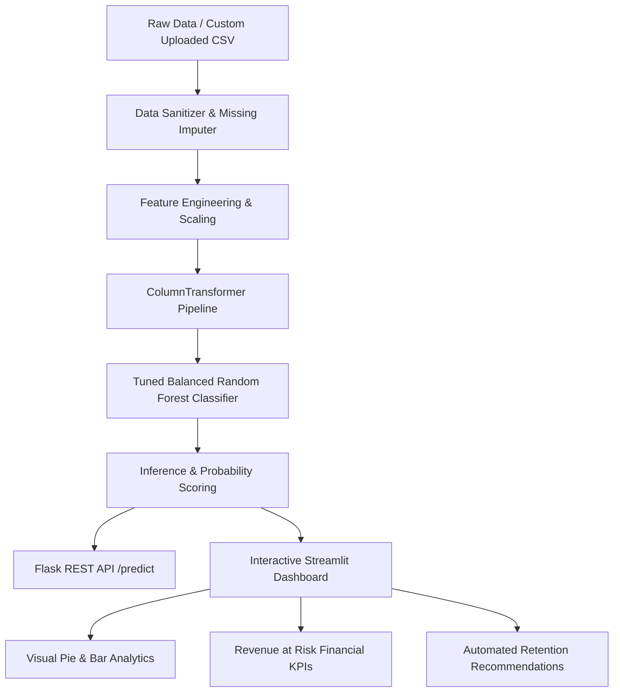

# 📊 Telco Customer Churn Prediction & Retention Intelligence

An end-to-end Machine Learning and AI Analytics platform to predict customer churn, identify key risk drivers, compute financial revenue at risk, and generate actionable customer retention strategies.

---

## 🚀 Key Features & Highlights

- **🧠 End-to-End Scikit-Learn Pipeline**: Fully integrated `ColumnTransformer` handling numerical imputation, scaling, and categorical One-Hot Encoding without data leakage.
- **⚖️ Balanced Random Forest Classifier**: Tuned hyperparameters with balanced class weighting to effectively capture churn minority classes (**ROC-AUC: 0.8370**, **Recall: 67.0%**).
- **📊 Interactive Streamlit Intelligence Hub**:
  - **Tab 1: Segment Explorer & Visual Analytics** — Live customer segment filters, **Churn Distribution Pie Chart**, **Top Churn Reasons Bar Chart**, **Revenue at Risk KPI Cards ($)**, and 1-click **CSV Download**.
  - **Tab 2: Single Customer Simulator** — Real-time risk probability gauge and tailored retention action plans.
- **📤 Custom Dataset Upload & Auto-Sanitizer**: Drag-and-drop custom customer CSV files with automatic fallback to the built-in 7,043-record dataset.
- **🔌 Production-Grade REST API**: Flask backend serving high-throughput `/predict` and `/health` endpoints with input validation.

---

## 🏗️ System Architecture & Workflow



---

## 📂 Project Structure

```
churn_prediction/
│
├── data/


│   └── Telco-Customer-Churn.csv       # Complete 7,043-customer dataset
├── models/
│   └── churn_pipeline.joblib          # Trained pipeline artifact (ROC-AUC: 0.8370)
├── src/
│   ├── train.py                       # Pipeline construction, tuning & training
│   ├── evaluate.py                    # Evaluation metrics (Accuracy, ROC-AUC, PR-AUC)
│   ├── predict_api.py                 # Flask REST API backend
│   ├── streamlit_app.py               # 2-Tab visual dashboard & custom CSV uploader
│   └── predict.py                     # CLI tool for single-customer predictions
├── app.py                             # Standalone batch analysis app
├── sample_test_customers.csv          # 50 unlabelled customer test scenarios
├── requirements.txt                   # Dependency list
└── README.md                          # Documentation
```

---

## 📈 Model Performance & Evaluation

The model was evaluated on a **20% stratified test split (1,409 unseen customer accounts)**:

| Metric | Score | Description |
| :--- | :--- | :--- |
| **ROC-AUC Score** | **0.8370** | High discrimination between churners and retained users |
| **Overall Accuracy** | **77.08%** | Reliable multi-feature classification |
| **Churn Recall** | **67.00%** | Captures 2 out of every 3 at-risk customers |
| **PR-AUC Score** | **0.6424** | Balanced precision-recall area under curve |
| **True Negatives** | **836** | Correctly identified retained customers |
| **True Positives** | **250** | Correctly flagged churners |

---

## 🛠️ Step-by-Step Implementation Details

### 1. Data Sanitization & Pipeline Construction ([`src/train.py`](src/train.py))
- Coerces string-based charges (e.g. whitespace in `TotalCharges` for `tenure=0`) into numeric values.
- Constructs numerical pipeline (`SimpleImputer(strategy='median')` + `StandardScaler()`).
- Constructs categorical pipeline (`SimpleImputer(strategy='most_frequent')` + `OneHotEncoder(handle_unknown='ignore')`).
- Trains `RandomForestClassifier(n_estimators=200, max_depth=12, class_weight='balanced')`.

### 2. Model Evaluation ([`src/evaluate.py`](src/evaluate.py))
- Evaluates the pipeline against the test split, printing classification reports, PR-AUC, ROC-AUC, and confusion matrix tables.

### 3. REST API Service ([`src/predict_api.py`](src/predict_api.py))
- Exposes `POST /predict` for JSON payloads.
- Validates missing attributes and infers probability and risk category (`Low`, `Medium`, `High`).

### 4. Interactive Web Interface ([`src/streamlit_app.py`](src/streamlit_app.py))
- Includes custom CSV upload with immediate visual feedback.
- Generates business retention playbooks based on feature drivers (e.g., *Contract upgrade discounts*, *Priority tech support*, *Auto-pay incentives*).

---

## ⚡ Quick Start Guide

### 1. Installation
```powershell
# Create & activate virtual environment
python -m venv venv
.\venv\Scripts\Activate.ps1   # On Windows
# source venv/bin/activate    # On Linux/macOS

# Install dependencies
pip install -r requirements.txt
```

### 2. Train the Pipeline
```powershell
python src/train.py
```

### 3. Run Web Dashboard
```powershell
python -m streamlit run src/streamlit_app.py --server.port 8501
```
*Access UI at: **[http://localhost:8501](http://localhost:8501)***

### 4. Run Flask Backend API (Optional)
```powershell
python src/predict_api.py
```
*Runs on port 5000 (`http://localhost:5000`)*

### 5. CLI Single Prediction
```powershell
python src/predict.py "{gender: Female, SeniorCitizen: 0, tenure: 2, MonthlyCharges: 95.0, Contract: Month-to-month, InternetService: Fiber optic, TechSupport: No, PaymentMethod: Electronic check}"
```

---

## 🔌 API Documentation

### `POST /predict`
**Request Payload:**
```json
{
  "gender": "Female",
  "SeniorCitizen": 0,
  "Partner": "No",
  "Dependents": "No",
  "tenure": 2,
  "PhoneService": "Yes",
  "MultipleLines": "No",
  "InternetService": "Fiber optic",
  "OnlineSecurity": "No",
  "OnlineBackup": "No",
  "DeviceProtection": "No",
  "TechSupport": "No",
  "StreamingTV": "No",
  "StreamingMovies": "No",
  "Contract": "Month-to-month",
  "PaperlessBilling": "Yes",
  "PaymentMethod": "Electronic check",
  "MonthlyCharges": 95.0,
  "TotalCharges": 190.0
}
```

**Response Payload:**
```json
{
  "churn": 1,
  "probability": 0.9268,
  "risk_level": "High",
  "risk_factors": [
    "Month-to-month contract (high cancellation flexibility)",
    "Short tenure (2 months) - high early lifecycle risk",
    "High monthly bill ($95.00/month)",
    "Fiber optic subscription without technical support",
    "Payment via Electronic Check (statistically higher churn rate)"
  ]
}
```

---

## 📄 License
Distributed under the MIT License.


